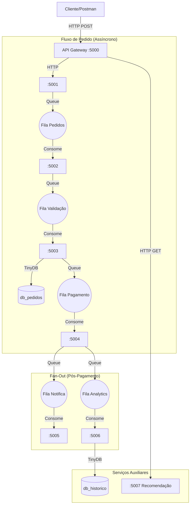

# 🚀 Sistema de Delivery - Arquitetura de Microserviços

Este projeto é uma implementação acadêmica de uma **Arquitetura de Microserviços** utilizando **Python (Flask)**. O objetivo é simular um ambiente AWS (Lambdas, SQS, DynamoDB) rodando localmente para fins didáticos.

## 📋 Sobre o Projeto

O sistema simula um backend completo de Delivery (tipo iFood/UberEats) onde cada responsabilidade é isolada em um serviço independente. A comunicação entre os serviços é feita de forma **assíncrona** utilizando **Filas em Memória** (`queue.Queue`), garantindo desacoplamento e alta performance.

### 🏗️ Arquitetura



---

## 🔌 Microserviços

| Serviço | Porta | Responsabilidade | Tipo |
|---------|-------|------------------|------|
| **API Gateway** | `:5000` | Recebe requisições e roteia para os serviços | Gateway |
| **Receber Pedido** | `:5001` | Aceita o pedido e joga na fila (Fire & Forget) | Producer |
| **Validar Pedido** | `:5002` | Valida cliente e estoque | Worker/Consumer |
| **Processar Pedido** | `:5003` | Salva o pedido no banco (Persistência) | Worker/Consumer |
| **Pagamento** | `:5004` | Simula transação financeira | Worker/Consumer |
| **Notificação** | `:5005` | Simula envio de e-mail ao cliente | Worker/Consumer |
| **Analytics** | `:5006` | Gera estatísticas e relatórios (ETL) | Worker/Consumer |
| **Recomendação** | `:5007` | Sugere produtos com base no histórico | API Rest |

---

## 🛠️ Tecnologias Utilizadas

*   **Python 3.12+**
*   **Flask**: Framework Web para criar os endpoints.
*   **TinyDB**: Banco de dados NoSQL orientado a documentos (Simula DynamoDB).
*   **Queue (Python Lib)**: Filas em memória (Simula AWS SQS).
*   **Requests**: Para comunicação HTTP entre serviços.
*   **Threading**: Para rodar workers em paralelo no mesmo processo.

---

## 🚀 Como Executar

### 1. Pré-requisitos
Certifique-se de ter o Python instalado e um ambiente virtual ativo.

### 2. Instalação das Dependências
```bash
pip install -r sistema_delivery/requirements.txt
```

### 3. Rodando o Sistema
Utilize o script gerenciador que sobe todos os 8 serviços simultaneamente:

```bash
python sistema_delivery/iniciar_todos.py
```
*O terminal exibirá logs coloridos indicando o status de cada serviço e worker.*

---

## 🧪 Como Testar

### Opção A: Script de Teste Automatizado ("Caminho Feliz")
Em outro terminal, rode o script que simula um fluxo completo de compra:
```bash
python testar_sistema.py
```
Isso irá:
1. Criar um Cliente
2. Criar um Produto
3. Fazer um Pedido
4. Aguardar o processamento assíncrono
5. Verificar se o pedido foi salvo, pago e notificado
6. Consultar recomendações e analytics

### Opção B: Postman (Manual)

**1. Criar Produto**
*   **POST** `http://localhost:5000/api/produtos`
*   JSON: `{"nome": "X-Bacon", "preco": 25.00, "estoque": 100}`

**2. Criar Cliente**
*   **POST** `http://localhost:5000/api/clientes`
*   JSON: `{"nome": "Maria", "email": "maria@teste.com"}`

**3. Fazer Pedido**
*   **POST** `http://localhost:5000/api/pedidos`
*   JSON: `{"cliente_id": "ID_DO_CLIENTE", "itens": [{"produto_id": "ID_DO_PRODUTO", "quantidade": 2}]}`

**4. Ver Relatório**
*   **GET** `http://localhost:5006/relatorio`

---

## 📂 Estrutura de Pastas

```
sistema_delivery/
├── data/                  # Arquivos .json do TinyDB (Persistência)
├── functions/             # Código fonte dos Microserviços
│   ├── api_gateway/
│   ├── receber_pedido/
│   ├── validar_pedido/
│   ├── ...
│   └── recomendacao/
├── shared/                # Código compartilhado
│   ├── filas.py           # Definição das filas em memória
│   └── databases.py       # Configuração do TinyDB
├── iniciar_todos.py       # Script para rodar tudo
└── requirements.txt       # Dependências
```
